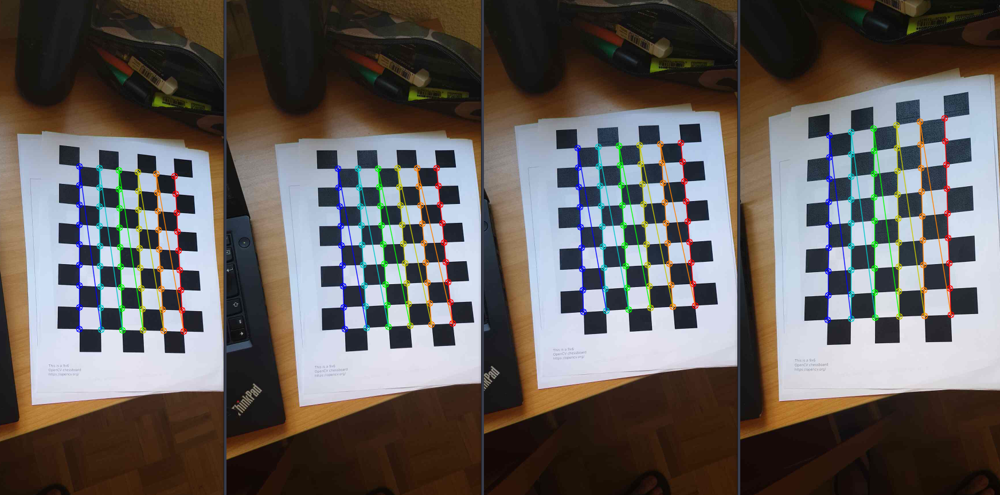

# Autolocalisation-System

#### 👨‍🎓 This project was carried out during my master's degree in computer vision at URJC - Madrid

Here you will find my solution to the "Autolocalisation system" exercise.

The goal of this one is to realize a self-locating system based on beacons (AprilTags type)

## Website

You can find more information about my project here : [My website](https://poubelle2604.wixsite.com/luis-2022-robotica/autolocation-system)

## Goals

- Be able to choose between an ip camera or the webcam
- Calibrate the camera / webcam with a chessboard paper
- Locate the tag(s)
- Determine the position of the camera

## Requirements

* Python 3.9+
* [AprilTag](https://april.eecs.umich.edu/software/apriltag)
* [Chessboard](https://docs.opencv.org/4.x/da/d0d/tutorial_camera_calibration_pattern.html)


* numpy ~= 1.21.3
* opencv_python ~= 4.5.5.64
* apriltag ~= 0.0.16
* matplotlib ~= 3.3.4

How to install all the requirements :

```bash
pip3 install -r requirements.txt
```

## Usage

Execute only from project directory

Use it with an ip camera :

```bash
python src/autolocationSystem.py -p -u=<IP>
```

Use it with a webcam :

```bash
python src/autolocationSystem.py -w
```

## Project details

This project is divided into two main parts.

The first one is the calibration step, for this we will use the opencv library and an object whose values are known (chessboard paper).

The second part is the localization of the tag to be able to determine the position of the camera, for that we will help us with the AprilTags library

<p align="center">
  
</p>
<p align="center">
  <i>Files needed (to print)</i>
</p>

## My solution

### 1. Choose the camara

First, before launching my program, we have to choose which camera we will use.
There are two possible choices:
- An ip camera (camera of our phone)
- A webcam

Once the camera is chosen you just have to launch the program.

If you start the program you should have the camera view and a three-dimensional graphic.
You can exit the program by pressing space, q or escape.

<p align="center">
  
</p>
<p align="center">
  <i>Camera view and 3d representation</i>
</p>

### 2. Calibration

Once the program is launched, you just have to place your chessboard sheet (9x6) on a table or on the floor and take 6 pictures of it with different camera positions.
(Do not take blurred or cropped pictures).

You can take the pictures by pressing the C key of your keyboard.

Once the 6 pictures have been taken, they will be shown on the screen with the detection of the corners of each square of the chessboard.
All you have to do is to check that none of the pictures are blurred or cropped.
If the detection of the corners was well done, you just have to calibrate your camera automatically by pressing the space key of your keyboard.

<p align="center">
  
</p>
<p align="center">
  <i>drawChessboardCorners() results</i>
</p>

Technical part:

The whole calibration part happens in the calibrate.py file.


The calibration of the camera is divided into X steps.
The first one is to detect the corners of each square of the chessboard, this is done with the opencv2 function : ```cv2.findChessboardCorners()```.
We can draw the corners results of the function ```cv2.findChessboardCorners()``` with the ```cv2.drawChessboardCorners()``` function.

Once we have all the corners for the six images, we will use ```cv2.calibrateCamera()``` to get the same parameters as :
- Root Mean Square error (RMS)
- Intrinsics matrix (K)
- Distortion coefficients
- Rotation vector (rvecs)
- Translation vector (tvecs)

Once you have found all these parameters it is very easy to calibrate your camera.

### 3. AprilTags

The whole calibration part happens in the ```aprilTags.py``` file.

For the geolocation system by tag, I decided to use the AprilTags library.
Once the tags are printed, we just have to use the library to detect the tags.

Here is the simple code to detect the tags (results are stocked in result variable) :

<p align="center">
  
</p>
<p align="center">
  <i>How to detect AprilTags</i>
</p>

<p align="center">
  
</p>
<p align="center">
  <i>Detection of an AprilTag</i>
</p>

### 4. Estimating the position of the camera

Once the tag is found, the library gives us the position of its centre in the image.
The centre of the tag represents the coordinates (0, 0) in the real world.
Thanks to the parameters found during the calibration of the camera we can deduce the position of the camera using this formula : 

<p align="center">
  
</p>
<p align="center">
  
</p>

Once we get the position of the camera in the real world, we just have to plot them on a 3d graphic.
For the 3d graphic I chose to use the MatPlotLib library.

<p align="center">
  
</p>
<p align="center">
  <i>3d camera positions representation</i>
</p>

### 5. Result

Here is the result of my algorithm. I don't have a gpu so when I run the program, my computer has a little trouble running it.

[](https://www.youtube.com/watch?v=bYiZiOSxBN8&ab_channel=Luis)

## Structure

    .
    ├── 3D_calibracion.pdf
    ├── imgs
    │    ├── cameras.png
    │    ├── code.png
    │    ├── draw.png
    │    ├── first.png
    │    ├── formula_1.png
    │    ├── formula_2.png
    │    ├── tag.png
    │    ├── toprint.png
    │    └── youtube.png
    ├── __pycache__
    │    ├── aprilTag.cpython-39.pyc
    │    ├── arguments.cpython-39.pyc
    │    └── calibrate.cpython-39.pyc
    ├── README.md
    ├── requirements.txt
    └── src
        ├── aprilTag.py
        ├── arguments.py
        ├── autolocationSystem.py
        ├── calibrate.py
        └── __pycache__
            ├── aprilTag.cpython-39.pyc
            ├── arguments.cpython-39.pyc
            └── calibrate.cpython-39.pyc

## Authors

* **Luis Rosario** - *Member 1* - [Luisrosario2604](https://github.com/Luisrosario2604)